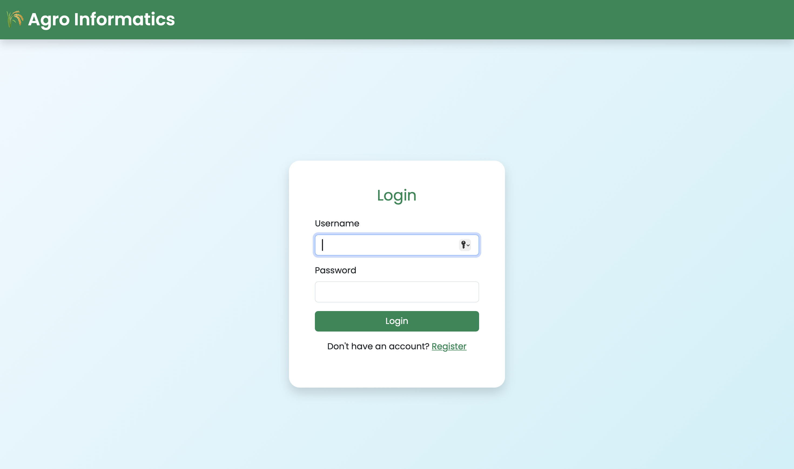
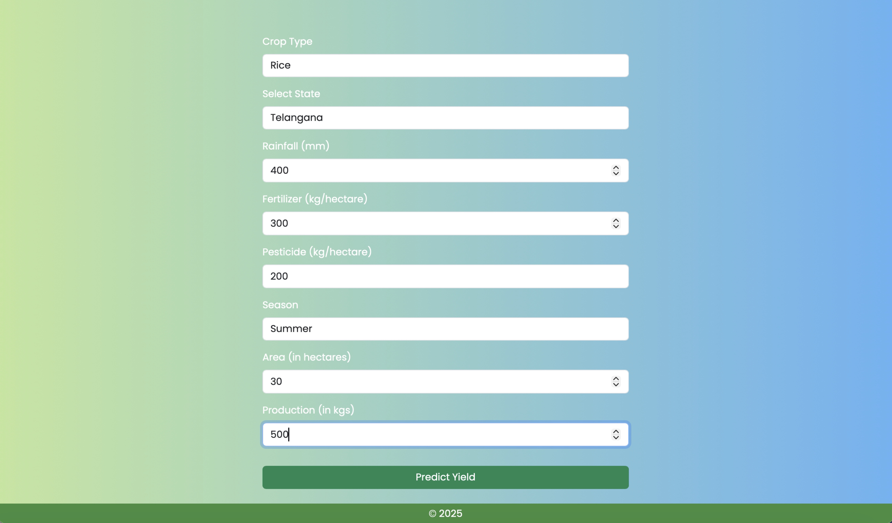
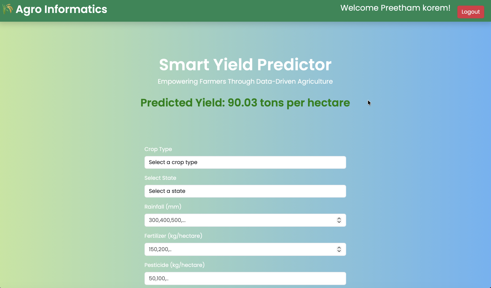

# Django Project Setup and Execution Guide

## 🛠️ Installation

Make sure you have **Python 3** and **pip** installed on your system.

### Step 1: Install Django
```bash
pip install django
```

### Step 2: Create a New Django Project
```bash
django-admin startproject projectname
```

### Step 3: Create a New App
```bash
python3 manage.py startapp appname
```

---

## 🚀 Execution Steps

### Step 1: Train the Model
```bash
python3 train.py
```

### Step 2: Test the Model
```bash
python3 test.py
```

### Step 3: Run the Django Development Server
```bash
python3 manage.py runserver
```

---

## 🌐 Access the Application

Once the server starts, open your browser and go to:

```
http://127.0.0.1:8000/
```


## ✅ Notes

- Ensure your app is added to `INSTALLED_APPS` in `settings.py`.
- Use `python` instead of `python3` if your system defaults to Python 3.
- Stop the server anytime using:
  ```bash
  CTRL + C
  ```

---





**Author:** Preetham Reddy Korem  
**Framework:** Django  
**Language:** Python 3
